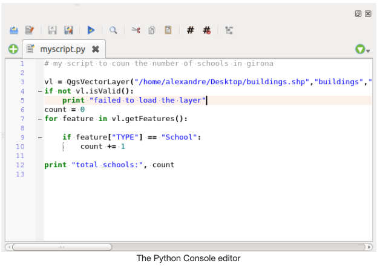

## The Open Source Geospatial Foundation
https://www.osgeo.org/

## QGIS
QGIS is a professional GIS application that is built on top of and proud to be itself Free and Open Source Software (FOSS).
It is a tool kit and ecosystem composed of different services and functionalities. I can also be extended with plugins, etc.

**Download QGIS:** https://qgis.org/en/site/index.html

**Resources for getting started:**
* https://www.qgistutorials.com/en/index.html
* [General information about QGIS software](https://en.wikipedia.org/wiki/QGIS)
* [The QGIS Python Console](https://docs.qgis.org/2.18/en/docs/user_manual/plugins/python_console.html#:~:text=The%20QGIS%20Python%20Console%20is,Ctrl%2BAlt%2BP%20).)
* [Introduction to QGIS Python programming for non-programmers](https://anitagraser.com/pyqgis-101-introduction-to-qgis-python-programming-for-non-programmers/)

### Most common usage scenarios
- Generating data, annotations and preparing it to archive it.
- Working with standalone data in diverse formats.

### The QGIS Python console

"QGIS provides a built-in console where you can type python commands and get the result. This console is a great way to learn scripting and also to do quick data processing. Open the Python Console by going to Plugins ‣ Python Console." - https://www.qgistutorials.com/en/docs/3/getting_started_with_pyqgis.html 

"The QGIS Python Console is an interactive shell for the python command executions. It also has a python file editor that allows you to edit and save your python scripts. Both console and editor are based on PyQScintilla2 package. To open the console go to Plugins ‣ Python Console (Ctrl+Alt+P)."

* Execute code snippets from the input area by typing and pressing Enter or Run Command

### The Code Editor

"allows editing and saving Python files and offers advanced functionalities to manage your code (comment and uncomment code, check syntax, share the code via codepad.org and much more)."

## GRASS GIS
Commonly referred to as GRASS (Geographic Resources Analysis Support System), it is a FOSS-GIS software suite used for geospatial data management and analysis, image processing, graphics and maps production, spatial modeling, and visualization. GRASS GIS is currently used in academic and commercial settings around the world, as well as by many governmental agencies and environmental consulting companies. It is a founding member of the Open Source Geospatial Foundation (OSGeo). GRASS GIS can be installed along with and made accessible within QGIS 3. 

**Download GRASS GIS:** https://grass.osgeo.org/

**Resources for getting started:**
* 

### Most common usage scenarios
- 

## GDAL 
is a multiplatform set of tools for translating between geospatial data formats. It can also handle reprojection and a variety of geoprocessing tasks. GDAL is built in to many applications both FOSS and commercial, including GRASS and QGIS.

**Download GDAL:** https://gdal.org/

**Resources for getting started:**
* 

### Most common usage scenarios
- 

## SAGA-GIS
Or System for Automated Geoscientific Analyses, is a FOSS-GIS application developed by a small team of researchers from the Dept. of Physical Geography, Göttingen, and the Dept. of Physical Geography, Hamburg. SAGA has been designed for an easy and effective implementation of spatial algorithms, offers a comprehensive, growing set of geoscientific methods, provides an easily approachable user interface with many visualisation options, and runs under Windows and Linux operating systems. Like GRASS GIS, it can also be installed and made accessible in QGIS3.

**Download SAGA-GIS:** http://www.saga-gis.org/en/index.html

**Resources for getting started:**
* 

### Most common usage scenarios
- 

## PostGIS
A geospatial extension to the PostGreSQL relational database.

PostGreSQL is

**Download PostGreSQL:** https://www.postgresql.org/

**Download PostGIS:** https://postgis.net/

**Resources for getting started:**
* 

### Most common usage scenarios
- 

## Python
Python is a programming language that lets you work more quickly and integrate your systems more effectively. Python is powerful and fast, plays well with others, runs everywhere, is friendly & easy to learn and is Open Source.

The Python Package Index (PyPI) hosts thousands of third-party modules for Python. Both Python's standard library and the community-contributed modules allow for endless possibilities. [Link](https://www.python.org)

**Anaconda** is a distribution of the Python and R programming languages for scientific computing, that aims to simplify package management and deployment. [Link](https://www.anaconda.com)

**NOTE:** if you have installed QGIS, you already have a working installation of Python on your system. All you need to get started is to launch QGIS and open the Python console (Plugins > Python console).

### Most common usage scenarios
* 

**Install Python with Anaconda:** https://www.anaconda.com/products/individual (scroll to bottom)

**Resources for getting started:**
* https://www.python.org/about/gettingstarted/
* https://anaconda.cloud/tutorials/8d29a356-46f8-4c5f-9fe8-3b3458b5a252?source=individual_tutorial 
* https://swcarpentry.github.io/python-novice-inflammation/
* http://swcarpentry.github.io/python-novice-gapminder/
* https://www.earthdatascience.org/courses/intro-to-earth-data-science/python-code-fundamentals/use-python-packages/use-conda-environments-and-install-packages/

## Jupyter Notebook

The Jupyter Notebook is an open-source web application that allows you to create and share documents that contain live code, equations, visualizations and narrative text. Uses include: data cleaning and transformation, numerical simulation, statistical modeling, data visualization, machine learning, and much more. [Link](https://jupyter.org)

### Most common usage scenarios
* 

**Download Jupyter Notebook:** https://jupyter.org/install

**Resources for getting started:**
* https://realpython.com/jupyter-notebook-introduction/

## R and RStudio
R is a language and environment for statistical computing and graphics. R provides a wide variety of statistical (linear and nonlinear modelling, classical statistical tests, time-series analysis, classification, clustering, …) and graphical techniques, and is highly extensible. One of R’s strengths is the ease with which well-designed publication-quality plots can be produced, including mathematical symbols and formulae where needed. 

R is available as Free Software under the terms of the Free Software Foundation’s GNU General Public License in source code form. It compiles and runs on a wide variety of UNIX platforms and similar systems (including FreeBSD and Linux), Windows and MacOS. [Link](https://www.r-project.org/about.html)

**RStudio** is an integrated development environment (IDE) for R. It includes a console, syntax-highlighting editor that supports direct code execution, as well as tools for plotting, history, debugging and workspace management. [Link](https://rstudio.com/products/rstudio/)

### Most common usage scenarios
*

**Download R:** https://mirror.lyrahosting.com/CRAN/ (Netherlands mirror)
**Download RStudio:** https://rstudio.com/products/rstudio/ (RStudio Desktop Recommended)

**Resources for getting started:**
* http://swcarpentry.github.io/r-novice-inflammation/
* http://swcarpentry.github.io/r-novice-gapminder/

## Git (Version Control)
Git is a free and open source distributed version control system designed to handle everything from small to very large projects with speed and efficiency. Git is easy to learn and has a tiny footprint with lightning fast performance. [Link](https://git-scm.com)

### Most common usage scenarios
* 

**Download Git:** https://git-scm.com/downloads

**Resources for getting started:**
* http://swcarpentry.github.io/git-novice/

## Data Version Control (DVC)

**Download DVC:**
Data Version Control is a new type of data versioning, workflow, and experiment management software, that builds upon Git (although it can work stand-alone). DVC reduces the gap between established engineering tool sets and data science needs, allowing users to take advantage of new features while reusing existing skills and intuition. [Link](https://dvc.org/doc/user-guide/what-is-dvc)

### Most common usage scenarios
* 

**Resources for getting started:**
* https://realpython.com/python-data-version-control/

## Questions?
[The Stack Exchange family](https://stackexchange.com/sites) is a collection of forums where software users can post questions and find information about the tools they are using. In particular, [Stack Overflow](https://stackoverflow.com/) has a wealth of information about using programming languages like Python and R, and there is a [GIS Stack Exchange](https://gis.stackexchange.com/) site as well for more specific GIS-related questions.  