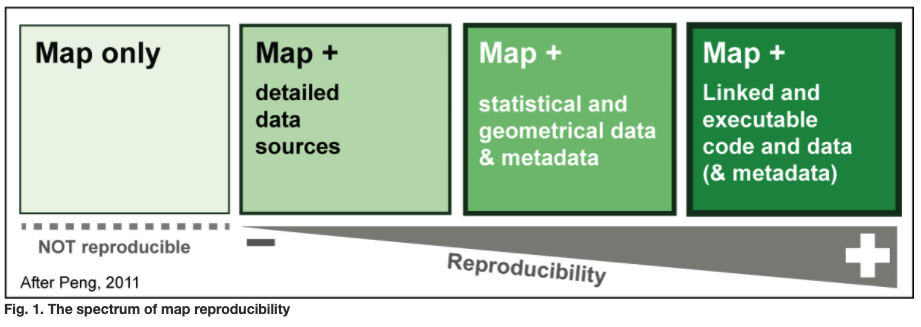

## Reproducibility

Fundamentally, the goal of transitioning to a code-based analysis workflow is to increase the reproducibility of your research results, which is increasingly required by publishers and just plain good practice in the scientific realm.

Learning how to work in Python or another programming language like R requires commitment and time to master. However, because these are highly useful and open-source tools that have applications in a broad array of disciplines, there is a plethora of knowledge available to help get started and troubleshoot challenges you run into. 

This Wiki contains links to learning resources and popular programming packages (collections of ready-made functions) in geospatial analysis, as well as hands-on demonstrations of how to transition to a more reproducible workflow by collecting, preparing, analysing, visualising and sharing data. 

*Image source: Girard & Lambert, https://riatelab.github.io/ReproducibleCartography/paper/paper.html

(Make an image to go with this)

1. Pull data from repository or source 
2. Organize data folder with raw data (read only), analysis scripts (read/write), plots (write only) and documentation (read/write)
3. Initialize git repository
4. Initialize DVC
5. Pull data into analysis program of choice
6. Perform analyses and produce outputs (make path to outputs separate folder)
7. Publish data and code (GitLab/Hub, 4TU, other)
- if 4TU, will mint a DOI used for citation, can integrate with GitHub
- create metadata according to domain standards, document meaning of variables, units, CRSs
- README.md file contains all info someone would need to reproduce your analyses on their own data

