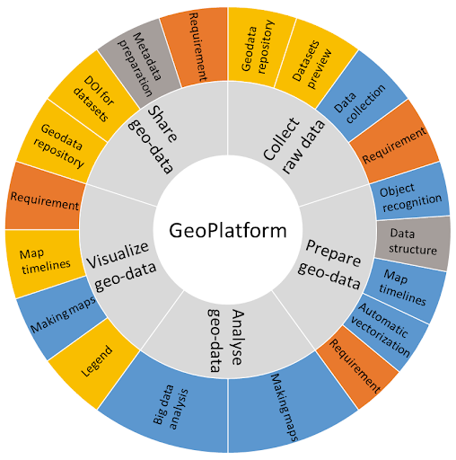

# About the DDH Community Data Wiki
The aim of the DDH Community Data Wiki is to articulate the Data Wheel framework into a practical and actionable FAIR data and software workflow. Through **ongoing community contributions and support**, this resource will grow to help researchers defining and recommending processes and tools for geographic and historic data collection, data verification, data publishing, as well as analysis, source management, and more.

The pages contain links to learning resources and popular programming libraries and packages (collections of ready-made functions) in geospatial analysis, as well as hands-on demonstrations of how to transition to a more reproducible workflow by collecting, preparing, analysing, visualising and sharing data. See the FAIR data and software section for information on including metadata and documentation to help make your research outputs Findable, Accessible, Interoperable and Reusable. 

Use the menu bar to navigate to each section of the Wiki. Have fun! :) 

Figure 1. The Data Wheel methodology (by Carola Hein and the Delft Digital Humanities group at Delft University of Technology).

