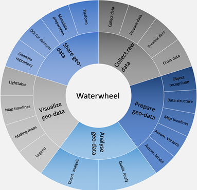

# About this wiki
Our aim with this wiki is to articulate the general data wheel framework into a set of workflows and tools that realize this general framework. We are defining and recommending processes and tools for different phases of the research workflow. Geographic and historic data collection, data verification, data publishing, as well as analysis, source management, and other aspects.

Figure 1. The Waterwheel methodology (by Carola Hein and a group working on Digital Humanities at Delft University of Technology).