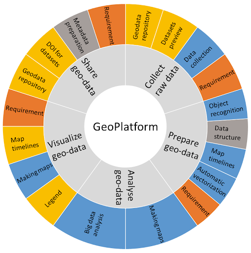

# About the DDH Community Data Wiki
The aim of the DDH Community Data Wiki is to articulate the Data Wheel framework into a practical and actionable FAIR data and software workflow. Through community contributions, this resource will grow to help researchers defining and recommending processes and tools for geographic and historic data collection, data verification, data publishing, as well as analysis, source management, and more.

Use the menu bar on the right side of the Wiki to navigate to each section of the Wiki. Have fun! :) 

Figure 1. The Data Wheel methodology (by Carola Hein and the Delft Digital Humanities group at Delft University of Technology).

